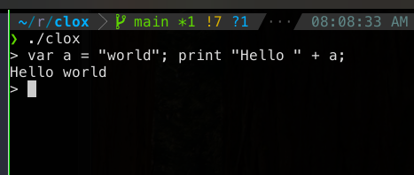
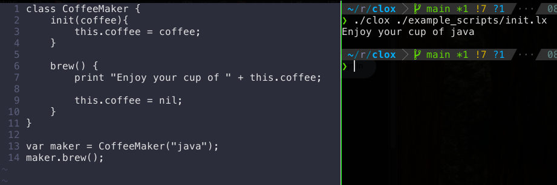

# clox

This is a bytecode interpreter for the "lox" programming language written in C.

This code follows along with the [Crafting Interpreters Book](https://craftinginterpreters.com/contents.html)
as part of the bi-weekly Codecademy Engineering Book Club.

## What is lox?

Lox is a dynamically typed, interpreted programming language with a C-like syntax.
It is a simple language designed specifically for this book.
See this [link](https://craftinginterpreters.com/the-lox-language.html) for a more in-depth overview.

## Requirements

- GCC (GNU Compiler Collection)
- Make

## Setup

Comment/uncomment any desired flags in the common.h file such as:

- DEBUG_PRINT_CODE
- DEBUG_TRACE_EXECUTION
- DEBUG_STRESS_GC
- DEBUG_LOG_GC

## Local dev

Run `make dev` to compile and run the REPL in one command.

## Compile

Run `make` command (with no args) to compile.

This will output a `clox` binary.

## Use

### REPL

For the REPL, run `./clox`
Note: each line you execute must be self-contained.
The REPL will not accept multi-line statements,
and only executes one line at a time in isolation.

### Scripts

Run `./clox [filename]` to load and run a lox script.
Check out the `example_scripts` directory for an idea of what the language can do.

